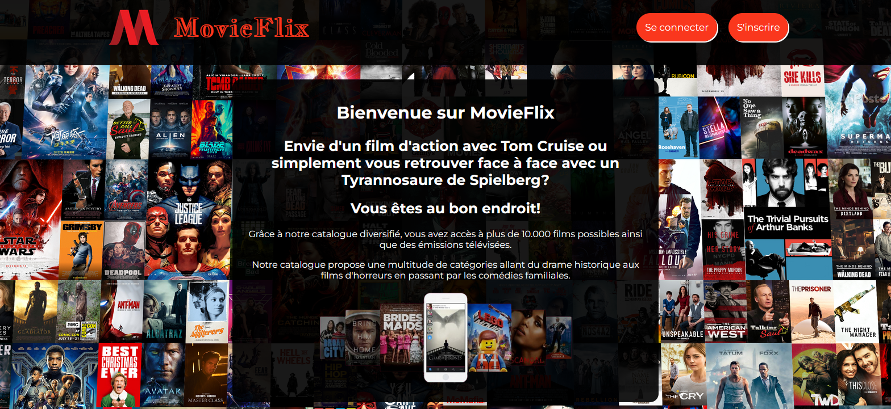
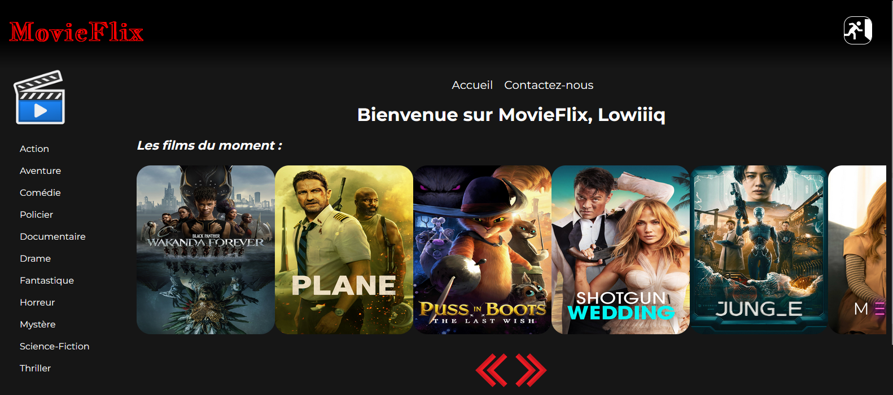
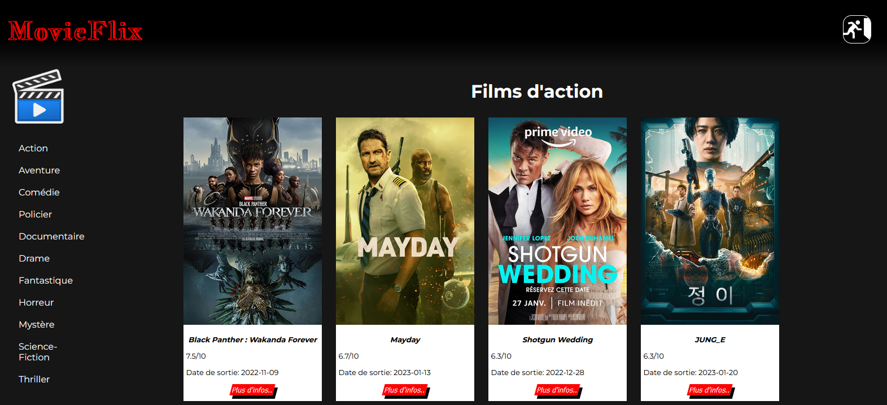
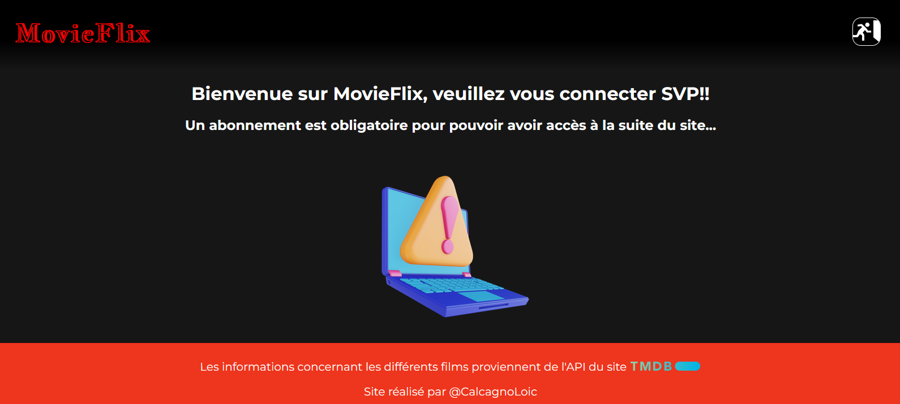
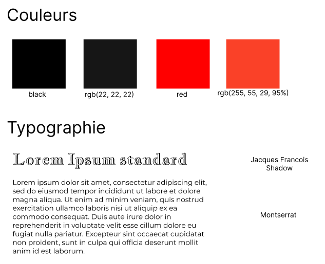

<h1 center="align"> MovieFlix </h1>

<p align="center">
    
    
    
    
    
    
    
    
    


</p>

Ce projet réalisé from scratch correspond à un projet solo mettant toutes les compétences apprises à Becode durant ma formation en tant que développeur junior. 

Ce site répertorie différentes catégories de film provenant de l'API de [TMDB](https://www.themoviedb.org/?language=fr).

Le prototype de ce projet à été réalisé grâce à Figma, dont la planche se trouve [ici](https://www.figma.com/file/hzoJoSl1dqi270I5WF2lnO/MovieFlix?node-id=0%3A1&t=BaC6tRPzvOPOf9Wf-0).

<h2>Conception du site</h2>

Le site se compose d'une page d'accueil sur laquelle, on peut se connecter ou s'inscrire.

<p align="center">
    
</p>

L'accès au site en lui-même avec les informations contenues dans l'API sont uniquement accessibles avec des identifiants présents dans la base de données. 
Voici les identifiants à utiliser pour pouvoir naviguer sur le site 👍

```
username : adminMovieFlix
email : admin@movieflix.be
password : 123456789
```

:stop_sign: <bold> ATTENTION, ne mettez aucunes informations confidentielles, utilisez uniquement ces informations ci-dessus ;) :stop_sign:

Voici un exemple lorsque la session est ouverte et que l'utilisateur décide de visualiser les films d'actions :

<p align="center">
    
    
</p>

Voici ce qu'un utilisateur non connecté verra : 

<p align="center">
    
</p>

<h2>Charte graphique</h2>

<p align="center">
    
</p>

<h2>Tâches réalisées</h2>

- [x] Squelette HTML 

- [x] Design CSS

- [x] Rendre responsive la page

- [x] Ajout du javascript

- [x] Connectivité PHP/MySQL

- [ ] Phase de testing

- [ ] Tests unitaires